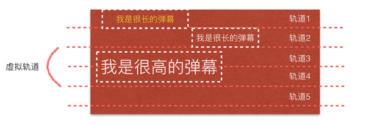
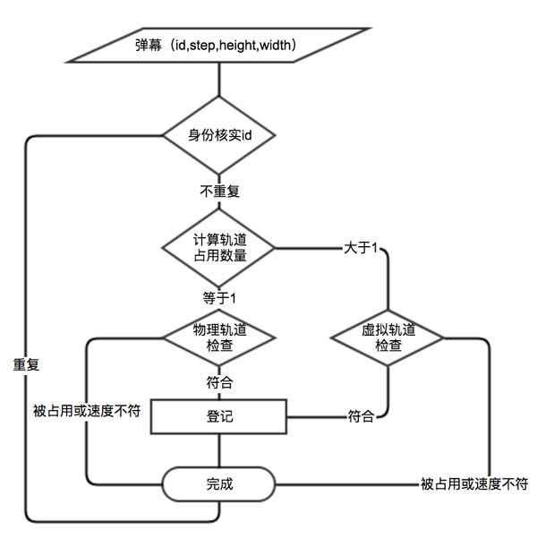
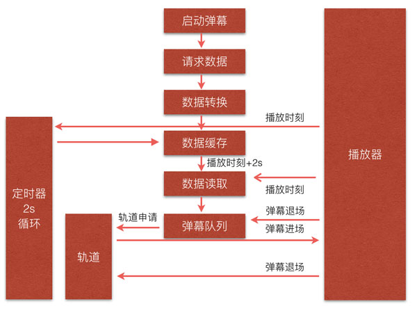

## Web视频播放器的弹幕插件设计

播放器弹幕是视频播放中很常见的业务，如何设计一个高性能、精准度的弹幕是件很很有挑战性、也很有趣的事情。本文讲述的是点播播放器的弹幕插件设计与直播有相似之处也有不同。

看过弹幕播放的截图后，我们思考一下几个问题：

- **弹幕的管理**
- **弹幕播放速度控制**
- **不同字号的弹幕位置计算**
- **弹幕的碰撞检测**
- **弹幕的动画播放设计**
- **弹幕与视频的同步**
- **弹幕的开关控制**

### **弹幕的管理**

对于点播来说，弹幕是通过接口一次性获取所有弹幕的，这点与直播不同。我们拿到所有弹幕数据以后如何对其管理是个值得思考的问题。在本文的设计中，我们无法保证服务端接口提供的数据格式和字段是相同的，考虑到弹幕插件的通用性，我们在获取所有弹幕数据之后提供一个数据转换接口，允许开发者自定义格式转换。通常情况下弹幕下发的字段包括核心的几个：

- *offset_time* 弹幕播放的相对时间
- *duration* 弹幕播放的时长，这个直接影响当前弹幕的播放速度
- *scale* 弹幕字体大小
- *color* 弹幕颜色
- *id* 弹幕标识

格式转换之后需要把原始数据都缓存起来，供后续步骤查询、过滤使用。

### **弹幕播放速度控制**

弹幕播放的速度控制主要包含两个方面，一、速度的计算；二、播放速度

- *速度的计算*

	速度的计算不难理解，比如播放器的宽度是300px，弹幕的播放时长10s，按照速度的定义是300/10=30px/s，其实按这个算出来能看出来弹幕是“卡顿”的，所有我们要考虑屏幕的帧率60fps，在30px/s的基础上再除以60，也就是30/60=0.5px/fps，这样保证动画是流畅的。更多细节参考[requestAnimationFrame](https://developer.mozilla.org/zh-CN/docs/Web/API/Window/requestAnimationFrame)。
- *播放速度*

	当我们计算出所有弹幕的速度，我们如何利用动画对其进行播放是个难题，一来要考虑的“入场顺序（动画开始）”、“出场顺序（动画结束）”，二来要考虑任何“符合条件”弹幕都是可以进入播放器播放的，然后播放器的空间是有限的，并不能允许所有弹幕上场。所以我们还需要管理播放的速度。另外，这里面还涉及碰撞检测问题，后续分别讨论。

### **不同字号的弹幕位置计算**

这个是弹幕播放比较难的一个问题了，再说这个问题之前，不得不说一下弹幕的动画原理：利用绝对定位。稍微理解前端性能问题的同学都知道，如果不把“动画元素”脱离文档流，大量的reflow和repaint会使浏览器“累死”。知道绝对定位以后，下一步就是控制弹幕的位置了。

如果我们有一个弹幕那就不是问题了，设置弹幕的起始位置就是播放器的右顶点(top:0;right:播放器的.width)。可是，那么多的弹幕如何计算每个将要入场的弹幕的起始位置，有了起始位置才可以动画播放。有同学说从上到下依次排列就好了，我们来看下几种情况：

这是第一种情况，按照从上到啊的顺序依次摆放以后会有几个问题：

1. 弹幕五、六、七该怎么计算位置，按top值循环取模+累加吗？
2. 当弹幕一或者弹幕三足够长的时候，如何准时的跳过当前位置计算？
3. 当前屏幕的弹幕播放结束，如何再计算的时候利用空出来的位置
4. 空出的位置是否满足当前弹幕的高度
5. ……

一系列问题就不统统列举出来了，在理论上，播放器在播放弹幕的时候空间使用率应该是最高才合理。本文提出“轨道控制”的概念来解决弹幕位置计算以及空间使用率最大化的问题。

### **弹幕的碰撞检测**

我们知道每个弹幕的播放时长是不同的，也就是用户看到的“滚动快慢”不一样。这就要求后面的弹幕不能碾压前面的弹幕，也不能影响相邻弹幕的位置，不然就会出现“覆盖”、“遮挡”等碰撞问题，解决这个问题要在弹幕位置计算这个时候考虑，位置计算不考虑速度就会出现碰撞的问题。同样，本文提出的“轨道控制”概念也是用来解决此问题的。

### **弹幕的动画播放设计**

前面有提到，弹幕的动画设计就是“绝对定位”+“requestAnimationFrame”来实现的。这个也是通常的动画解决方案就不多说了。至于为什么不用setInterval或者setTimeout，大家可以深入理解下JavaScript的单线程运行机制。

### **弹幕与视频的同步**

弹幕的播放时间与播放时长都是与视频的播放进度相关联的，我们一方面要保证只在视频的播放时刻选择性的播放相关联的弹幕，一方面要满足在指定的时长内结束弹幕的播放。这也就意味着播放、暂停、快进等操作都要同步弹幕的播放动作。

### **弹幕的开关控制**

这个就很好理解了，有个总开关控制弹幕的播放动作，可以随时开启和关闭。当然，开启之后的同步问题也要解决，比如从某个时刻开启的，弹幕则不能从0开始播放，这与视频同步播放的需求是一致的。

### 方案设计

上面列举了N个问题，接下来我们就是设计方案一一解决问题。冷静的把弹幕的需求梳理一下，是不是感觉和机场的运行模式有点像呢？

首都国际机场一共有3条跑道，两条4E级跑道、一条4F级跑道，2016年的吞吐量为9000万人次。它的运行机制就是所有飞机通过搭台有顺序的共用3条跑道来完成运输任务的。

同理，我们也设计了几个个角色：一个是轨道(跑道)、一个是调度(塔台)、一个是弹幕(飞机)，我们为每个角色设计一个类分为为Track、Main、Bullet。

- **轨道**

	轨道这个角色很重要，它可以解决弹幕位置计算、速度控制、碰撞检测问题。

	首先，我们要来初始化轨道。通俗的说我们要修建几个跑道呢，我们不是实物，可以动态调整轨道的数量，计算的原则：

	 **轨道数量 = 播放器有效高度 / 设备基准字号**

	- 播放器有效高度：播放器的实际高度减去控制条的高度，因为弹幕不可以遮挡控制条。
	- 设备基准字号：移动端是10px，pc端是12px；

	为啥计算公式是这样的？因为我们要支持不同字号的弹幕。试想不同的字号对物理空间的占用是不同的，然而如果要求轨道的尺寸是动态的，那就带来很复杂的计算。本文提出“虚拟轨道”的概念，在交通管制中最常见的就是道路合并或者改向。我们也是采用将相邻的物理轨道临时合并为一条轨道。这样就可以轻松的解决不同字号的轨道占用问题。原理图如下：

	

	然后，我们要正式的启用轨道了。

	1. 机长呼叫塔台，CZ6132请求起飞。
	2. 塔台查看跑道使用情况
		- 目前跑道均被占用，请等待

			N时刻后再次执行步骤1
		- 目前跑道 A1 空闲，准许进入

			执行步骤3
	3. 进入跑道，起飞完成
	4. 机长通知塔台，本次起飞完成，释放跑道的占用
	5. 其他飞机同样执行上述步骤

	机场的调度机制也是我们本方案的设计思路，如下：

	1. 弹幕请求进入播放器
	2. 轨道根据弹幕的播放速度、尺寸计算是否有合适的轨道提供
		- 没有

			通知弹幕尚无合适轨道提供，请等待；同时，弹幕队列中的其他弹幕依次执行步骤1
		- 有

			执行步骤3
	3. 播放器加载弹幕DOM，开始播放，待播放完成
	4. 播放完成通知轨道更新轨道占用情况
	5. 其他弹幕同样执行上述步骤

	【注】仔细对比下，在步骤2中有一个区别就是无法提供轨道的时候，其他弹幕依次尝试，而不是所有的弹幕都等待，这是为什么？很简单，飞机的跑道只能被一个飞机占用，而弹幕则可以使用同一个轨道，不过这是有前提的，后者的播放速度小于前者（解决碰撞问题）。

	那么轨道是如何计算可用性呢？如图：

	

	关于轨道的基本原理我们整理清楚了，当然还有不少细节比如如何和调度通信、如何和弹幕通信以及虚拟轨道检测算法等。有兴趣的同学可以参考代码吧。

- **弹幕**

	弹幕基本是实现“飞机”的角色，我们要求它具有自身的属性和方法。比如调度中心通过id能拿到它所有的基本信息，轨道控制也可以通过弹幕进行检查和更新。当然弹幕也必须具备状态自动更新、移动、播放结束通知、自动销毁等功能。

- **调度**

	调度就是搭台的化身，承接着轨道、弹幕的控制，也保持着与播放器的步调一致。它的职责如下：

	1. *播放器交互控制*
	2. *弹幕队列控制*
	3. *自身状态更新*
	4. *数据格式转换*
	5. *动画执行*

	我们重点说一下“弹幕队列控制”，原理图如下：

	

	在弹幕启动之后，首先要检查本地是否已有缓存数据，没有的话直接请求数据并缓存，然后执行数据读取，首次过滤数据进入弹幕队列，同时启动定时器。弹幕队列的数据会定期请求轨道，检测队列里的弹幕是否可以进入，一旦确认后轨道做好登记，弹幕就可以进入播放器开启动画播放了。定时器每隔2秒就会再次更新数据进入到弹幕队列（这块不同的业务可以定制不同的规则）。弹幕播放结束后会通知调度和轨道，调度会在弹幕队列中移除该弹幕实例，轨道也会移除该弹幕实例的轨道占用。

关于弹幕设计，今天就讲到这，有兴趣的同学可以一起讨论。
